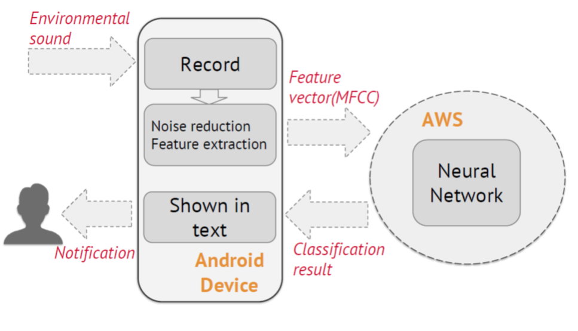

### Capstone Design: Visual Sound Assistant

- Group Members: **Song Yang**, Xing Yang, Tong Wu, Ke Xia
- Advisor: Prof. Yingying Chen

**Abstract:** 

As the smartphone becomes popular, we want to apply mobile technology on the hearing problems 
support area and reach a goal to help them identify what's happening around by analyzing sounds and 
coming up with information in messages. These text infonnation can remind people to take 
corresponding actions if necessary. Considering professional teachers and time are needed for the 
sign language and assistant devices are expensive, we'd like to develop an App based on physical 
devices with a microphone. 

Our work focuses on the deep learning algorithm. Steps include feature extracting and 
classification. We use the neural network to train the classification model. The final result is 
represented as an Android application with functions ofreal-time sampling, test and provide a 
friendly interface. The accuracy of the classification model is around 96%.

