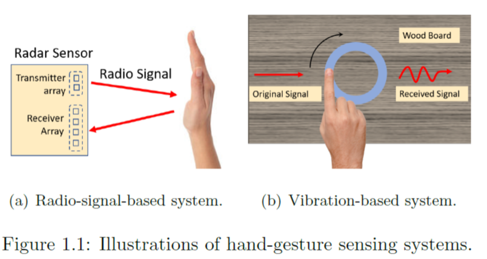

### Master Thesis

- Title: Hand-gesture Sensing Leveraging Radio and Vibration Signals
- Author: Song Yang
- Advisor: Dr. Yingying Chen
- Comittee Members: Dr. Richard Howard, Dr. Chung-Tse Michael Wu
- [FullText](./master_thesis_Song%20Yang.pdf)

**Abstract:** 

Gesture recognition that enriches human-computer interaction (HCI) has gained considerable attention recently. Existing solutions such as computer-vision-based approaches recognize and track human hand/body gestures using cameras or visible light. However, they all require line-of-sight and are susceptible to interference from light sources. In this thesis, an innovative approach using ambient radio and vibration signals is implemented to achieve fine-grained hand/finger gesture recognition. By sensing the infuence of hand/finger gestures on the transmitted radio signals (e.g., millimeter wave signals) and physical vibrations, the position of the hand/finger can be precisely estimated through machine-learning-based techniques. Particularly, we implemented two types of solutions that work separately. (1) mmWave-based: we leverage frequency-modulated continuous-wave (FMCW) radar to track hand movements and recognize various hand gestures; and (2) vibration-based: we capture the tiny disturbance in the surface vibrations caused by user's finger touches to discriminate user's finger input on the surface. Extensive experiments demonstrate that our proposed approaches can accurately track and recognize user's hand gestures with high accuracy.

